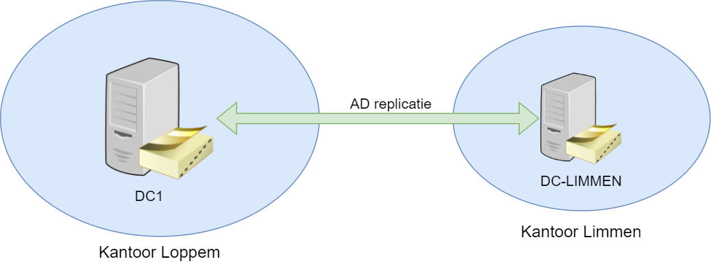
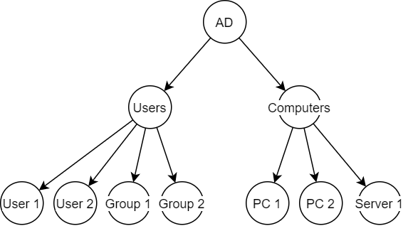
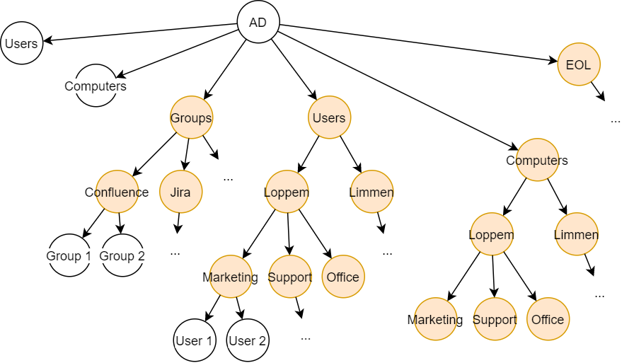
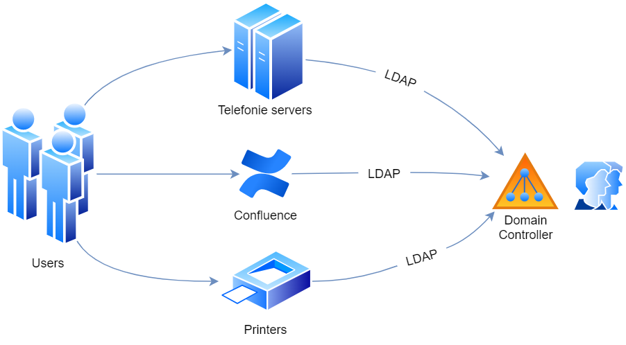

# Active Directory

Active Directory is de naam die word gegeven aan de directory service van Microsoft voor een Windows Domain. Het komt inbegrepen bij meeste Windows Servers als een verzameling van services. Een Windows server die Active Directory draait is gekend als een Domain controller.

## Domain Controller

De domain controller is een Windows Server waar alle gebruikers en computers worden in opgeslagen. Het zal de gebruikers en computers gaan authenticeren en authorizeren in een Windows domain. Bijvoorbeeld als iemand inlogt met een windows computer die lid is van het domain dan zal de domain controller het ingegeven gebruikersnaam en wachtwoord controleren.

Het grootte voordeel hiervan is dat alles op 1 plek wordt opgeslagen waardoor het gemakkelijk is voor IT personeel om alles te onderhouden. Wanneer er meerdere domain controllers zijn dan zullen die onderling gesynchroniseerd worden zodat ze altijd in sync zijn met elkaar. Dataline heeft nu in totaal 2 domain controllers, één staat in Loppem en de andere staat in Limmen (Nederland).

De 2 domain controllers staan op 2 geografisch verschillende locaties. Een andere naam voor locatie die gebruikt wordt in context van domain controllers is **Site**. Hier zal er synchronisatie tussen 2 verschillende Sites gebeuren en dit wordt ook wel een **intersite verbinding** genoemd. Wanneer 2 dc's zich op dezelfde site bevinden wordt het een **intrasite verbinding** genoemd.

### Services

Dit zijn de services waarvoor een domain controller allemaal gebruikt wordt.
- Users en computers beheren
- Security policies enforcen op het domain
- DNS server
- DHCP server

### Nieuwe Domain Controller

Om de synchronisatie naar de cloud te doen hebben we minsten een Windows Server van 2016 nodig. Domain controller DC1 voldoet hier niet aan en daarom moeten we een nieuwe domain controller gaan installeren. We geven die domain controller een logische naam **DC-LOPPEM**. Deze domain controller zal in het begin samen werken met DC1 en na een tijdje zal DC1 uitgeschakelt worden en neemt DC-LOPPEM de taak over. 

## OU-structuur

OU of Organisational Unit is een manier om Active Directory objecten te gaan groeperen. Het wordt gebruikt om structuur te steken in een domain, vergemakkelijkt het beheer en kan gebruikt worden om de verschillende afdelingen en locaties voor te stellen. OU's kunnen andere OU's bevatten en Microsoft raad het gebruik ervan aan.

### Huidige structuur

De huidige structuur van Dataline werkt nog niet met OU's en men zou graag overstappen naar een duidelijke OU-structuur. Nu wordt nog een oude structuur gebruikt die er als volgt uitziet.

Je kan zien dat 2 mappen gebruikt worden genaamd Users en Computers. Dit zijn 2 standaard directories die in elke domain controller aanwezig zijn. Users wordt gebruikt voor gebruikers en groepen terwijl computers gebruikt gebruikt wordt voor computers en servers. Dit is een oude manier van werken waar alle objecten samen zitten en er is geen structuur in de indeling.

### Nieuwe structuur

De nieuwe manier van werken zal OU's gebruiken om objecten te groeperen per soort, per afdeling en per locatie. Op die manier is het gemakkelijker werken en zijn er meer mogelijkheden om gebruikers te beheren. De nieuwe structuur ziet er als volgt uit. De oranje toppen stellen OU's voor.

Er zal een OU zijn voor enkel groupen en die zal nog eens verdeeld worden onder de verschillende applicaties. Er is een OU voor gebruikers die we eerst zullen opsplitsen per locatie en dan per afdeling. Op deze manier wordt het direct duidelijk waar en op welke afdeling een gebruiker werkt. Voor Computers volgen we dezelfde structuur.

EOL hier staat voor **End Of Life**, hier komen de objecten die niet meer gebruikt worden. Dit kan handig zijn want als bijvoorbeeld een werknemer weg gaat en dan later terug komt hebben we nog steeds zijn user object.

Dit is niet de volledige structuur, maar het geeft een beeld wat het zou moeten worden.

### Problemen

We moeten overstappen naar de nieuwe structuur maar dit brengt enkele problemen met zich mee. Vele applicaties en services gebruiken nog de oude structuur en kunnen mogelijks niet meer functioneren als we overschakkelen op de nieuwe structuur. De reden hiervoor is omdat vele applicaties enkel in de Users directory zoeken naar gebruikers en groepen.

De manier waarop die applicaties gaan communiceren met de domain controller is aan de hand van het **LDAP protocol**.

## LDAP

LDAP of **Lightweight Directory Access Protocol** is een netwerkprotocol voor het opvragen en onderhouden van een directory service over TCP/IP. Het is een open standaard die door veel applicaties ondersteund wordt. Apps en services van Dataline gebruiken het als een interface om gegevens op te vragen van Active Directory. 

Als voorbeeld nemen we eens de printers van Dataline. Die hebben de optie om een document in te scannen en door te mailen naar een werknemer. De printer zelf zal een LDAP query gaan uitvoeren op de domain controller om alle gebruikers op te halen. Die query zal er als volgt uitzien.

- **LDAP query root**: `CN=Users,DC=dataline,DC=eu`
- **LDAP query**: `(objectclass=user)(objectCategory=person)`

De **root** is de plek waar de query zal uitgevoerd worden en hier wordt dit de Users map. Dat wil zeggen dat we enkel objecten vinden die in de Users map zitten of in een submap ervan. De **query** zelf zal zoeken naar alle gebruikers objecten.

### Nieuwe Queries

Om de applicaties klaar te maken voor de nieuwe structuur moeten we dus bij elke applicatie de **query root** aanpassen zodat we niet meer enkel zoeken in de Users map. De **LDAP query** zelf heeft geen verandering nodig want we zoeken nog steeds naar dezelfde objecten in AD.

Bij de printers wordt de query dan uiteindelijk:

- **LDAP query root**: `OU=Dataline Users,DC=dataline,DC=eu`
- **LDAP query**: `(objectclass=user)(objectCategory=person)`

## Voorbeelden

Nog enkele voorbeelden van LDAP queries:

#### Gebruikers zonder email
`(objectcategory=person)(objectCategory=Person)(!mail=*)`

#### Alle admin accounts
`(objectClass=user)(objectCategory=Person)(adminCount=1)`

#### Alle lege groepen oplijsten
`(objectCategory=group)(!member=*)`

#### Alle gebruikers lid van een groep
`(objectclass=user)(MemberOf=CN=Groep naam,CN=Users,DC=dataline,DC=eu)`

