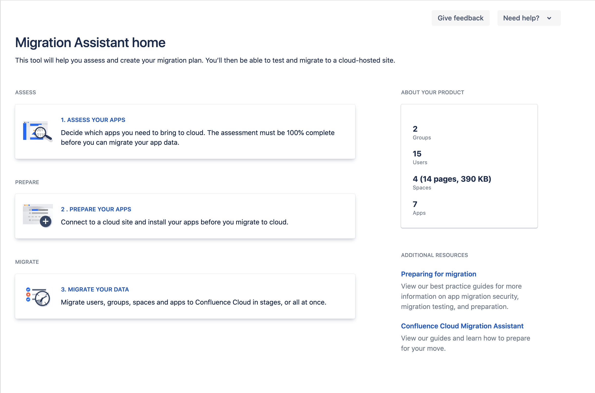
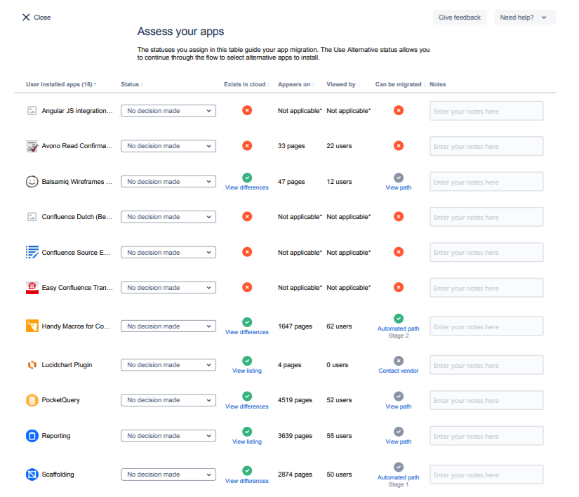

# Confluence

## Confluence Producten

Confluence stopt support voor de standaard server producten. Dat is de versie die Dataline nu voorlopig nog gebruikt. De support hiervoor stopt in 2024. Er zijn in totaal 3 producten van Confluence. 

- Server editie
- Datacenter editie
- Cloud editie

De server editite stopt in 2024 en Atlassian verplicht mensen om over te stappen naar de Datacenter of Cloud editie. De cloud editite meer programma's heeft waar we tussen kunnen kiezen:

| | Free | Standard | Premium | Enterprise |
| :--- | :---: | :---: | :---: | :---: |
| Prijs per user | 0 | $5,50 | $10,50 | Jaarlijkse Factuur |
| Prijs per maand (50 users) | 0 | $275 | $525 | Jaarlijkse Factuur |
| Max aantal gebruikers | 10 | 20.000 | 20.000 | 20.000 |
| Storage | 2 GB | 250 GB | unlimited | unlimited |

Dan hebben we ook nog de Datacenter versie die $27.000 kost per jaar. Daarmee krijgen we het volledige pakket en kunnen we nog lokaal on-premise blijven werken. Atlassian zegt zelf het volgende

> Met onze Data Center-producten kun je profiteren van de flexibiliteit om te implementeren op een infrastructuur naar keuze. Dit is de beste keuze voor degenen met unieke of complexe operationele vereisten of die verder willen opschalen dan onze huidige cloudgebruikersniveaus. Als je upgradet heb je volledige controle over gegevensbeheer, beveiliging en compliance, en over hoe je uptime en prestaties beheert. **We raden Data Center aan voor degenen die strengere vereisten hebben en nog niet kunnen overstappen naar cloud**.

Mijn eerste indruk is dat de Datacenter editite niet voor ons zal zijn aangezien het duur is en enkel nodig is als je nog niet de vereisten hebt om naar de cloud over te stappen. De logische keuze lijkt te gaan naar de standard cloud editie, aangezien die goedkoop is en juist genoeg storage zal hebben. Onze huidge confluence server heeft namelijk 256 GB aan storage.

[Hier](https://www.atlassian.com/nl/migration/assess/compare-cloud-data-center) kan je nog eens alle verschilllen tussen de cloud versie en de datacenter versie zien.

## Jira

Een ander product van Atlassian is Jira. Dit is een issue tracking programma die bugs kan tracken en zorgen voor agile project management. De producten die ze hebben van Jira zijn de volgende:

- Jira Cloud
- Jira Server
- Jira Datacenter

Gelijkaardig met Confluence stopt de support voor de server versie in 2024. De cloud editie is de logische keuze aangezien de Datacenter edition zeer duur is en gericht is op grote bedrijven die nog niet klaar zijn om naar de cloud over te stappen. De cloud editie komt in volgende versies:

| | Free | Standard | Premium | Enterprise |
| :--- | :---: | :---: | :---: | :---: |
| Prijs per user | 0 | $7,50 | $14,50 | Jaarlijkse Factuur |
| Prijs per maand (50 users) | 0 | $375 | $725 | Jaarlijkse Factuur |
| Max aantal gebruikers | 10 | 20.000 | 20.000 | 20.000 |
| Storage | 2 GB | 250 GB | unlimited | unlimited |

Voor ons is de standard versie de beste keuze aangezien deze het goedkoopst is en we er genoeg features mee krijgen.

## Hoe overstappen naar cloud

Migreren gebeurt met de Confluence Cloud migration Assistant. Dit is een applicatie die het gemakkelijk maakt om de data, gebruiker en groepen van Confluence te brengen naar de Cloud. Voor Jira is er een andere applicatie beschikbaar namelijk de Jira Cloud Migration Assistant. Die werkt gelijkaardig als de Confluence migration assistant.

We zien dat er 3 fasen zijn om te gaan migreren naar de cloud.

### Assess your apps

In deze stage kun je alle applicatie (plugins) gaan zien die geïnstalleerd zijn op Confluence. Per applicatie kan je dan zien of de app kan gemigreerd worden en indien dit mogelijk is het pad die je moet volgen. Er zijn een heleboel applicaties die amper gebruikt worden en die waarschijnlijk gewoon weg mogen. De belangrijkste applicaties zullen de volgende zijn: Handy Macro's, PocketQuery, Reporting en Scafolding.

Merk op dat er bij can be migrated verschillende mogelijkheden zijn. Je hebt de volgende opties.

| | Beschrijving |
| :-----: | :--- |
| :x: | Applicatie kan niet gemigreerd worden aangezien er geen alternatief is voor in de Cloud. |
| :heavy_check_mark: (view path) | Applicatie kan gemigreerd worden naar de cloud maar niet volledig automatisch. Er zijn nog bepaalde dingen waar rekening moet mee gehouden. |
| :heavy_check_mark: (automated path - stage 1) | Applicatie in stage 1 hebben een ongekende of lage migratie success rate. Met andere woorden er is een grote kans dat het fout loopt. Bij problemen moet je contact opnemen met de app vendor. |
| :heavy_check_mark: (automated path - stage 2) | Applicaties in stage 2 hebben een hoge success rate voor migratie naar de cloud. |

#### BELANGRIJK!

Er zijn een aantal Queries van PocketQuery die niet ondersteund worden in de cloud! Die plugin is nodig om data van externe systemen op te lijsten in confluence. In de access your apps pagina hier boven kun je zien dat PocketQuery gebruikt word door 4519 pagina's in Confluence nu. PocketQuery kan gemigreerd worden naar de Cloud maar wel niet automatisch. Daarom dat we niet direct zullen kunnen migreren naar de cloud aangezien die queries eerst moeten vervangen worden door dingen die wel werken in de cloud.

## Automatic User/Group Provisioning

Wat gebeurt er met de user accounts? Nu worden die gesynchroniseerd on premise AD maar als we naar de cloud zullen gaan hoe moet dat dan gebeuren. We moeten hiervoor Azure AD gebruiken. Atlassian geeft ons de mogelijkheid om dit te doen maar we moeten wel aan een aantal prerequisites voldoen.

**Prerequisites**

Dit zijn de benodigheden om Azure AD te gaan kopelen volgens Microsoft:

- An Azure AD tenant
- A user account in Azure AD with permission to configure provisioning (e.g. Application Administrator, Cloud Application administrator, Application Owner, or Global Administrator)
- An Atlassian Cloud tenant with an Atlassian Access subscription
- A user account in Atlassian Cloud with Admin permissions

Je kan zien dat we om automatic user provisioning te gaan implementeren we een abonnement nodig hebben voor **Atlassian Access**. Atlassian zegt zelf:

> User provisioning is available when you subscribe to Atlassian Access. Read more about how to start with Atlassian Access.

Hieronder kan je de prijzen zien van de verschillende abonnementen:

| Prijs per user | 100 users | 500 users | 1000 users |
| :--- | :---: | :---: | :---: |
| Confluence | $5,50 | $5,50 | $5,50 |
| Confluence + Access | $9,50 | $7,44 | $6,79 |