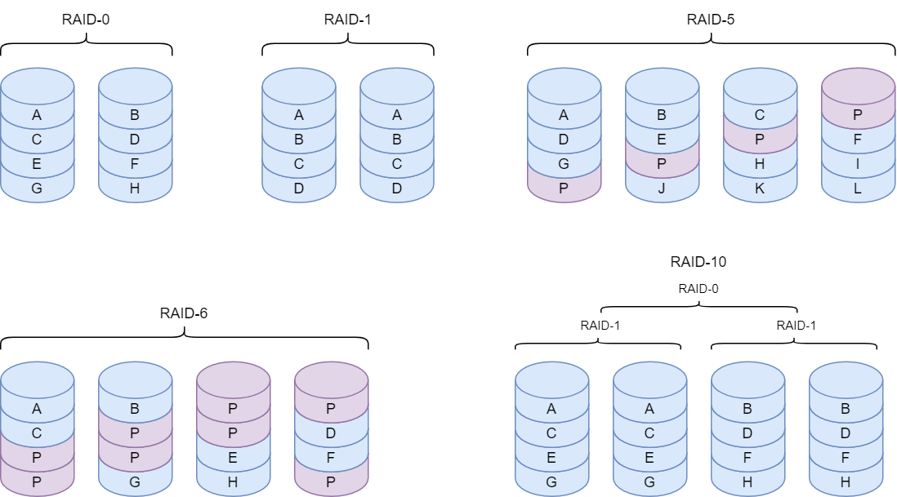

# Data Storage

Om de applicatie op te zetten gebruik Dataline Virtuele Machines. Die VM's draaien op fysieke server die elk hun eigen storage hebben. Hier worden de virtuele servers besproken en hoe de storage precies in elkaar zit.

## Begrippen

Voor dat we beginnen eerst wat extra informatie over bepaalde begrippen zodat alles duidelijk is.

### Hypervisor

Een **Hypervisor** of een VMM (Virtual Machine Monitor) dient om meerdere besturingssystemen tegelijk op een computer te laten draaien. Hyper visors zijn opgedeeld in 2 types. Type 1 (Native) en Type 2 (Hosted).

<ins>**Type 1**</ins>

Een type 1 hypervisor draait rechtstreeks op de computer hardware en daarom word deze ook Bare Metal genoemd. Er is geen tussenkomst van het Besturingssysteem van de host. Dit wil zeggen dat Type 1 hypervisors efficiënt zijn om resources te gaan uitdelen aan de virtuele machines.

Enkele voorbeelden van type 1 hypervisors zijn: **VMware ESXi, Citrix Xen, KMV en Microsoft Hyper-V**.

<ins>**Type 2**</ins>

Een type 2 hypervisor zal niet rechtstreeks werken op de computer hardware. Er zit nog een Besturingssysteem tussen. Een voordeel van een type 2 hypervisor is dat het gemakkelijk te gebruiken is omdat het kan geïnstalleerd worden als een programma. Het nadeel hiervan is dat het minder efficiënt is aangezien er nog een besturingssysteem tussen zit. 

Voorbeelden van type 2 hypervisors zijn: **Oracle VirtualBox, VMware Workstation, Parallels Desktop**.

### RAID

RAID of redundant array of independant disks. Het wordt gebruikt om harde schijven te gaan combineren in 1 enkel volume. Het doel ervan is om reads-/writes te versnellen of om data te beschermen. Er zijn verschillende soorten RAID. We hebben RAID-0, RAID-1, RAID-5, RAID-6 en RAID-10.

| Type | Beschrijving |
| :----- | :--- |
| RAID-0 | Deze manier wordt ook striping genoemd en dient voornamelijk om storage te gaan versnellen. De data wordt verspreid over 2 harde schijven. Dit zorgt ervoor dat je data tegelijk van beide schijven kan ophalen. |
| RAID-1 | Deze manier wordt ook mirroring genoemd. Er wordt een kopie opgeslagen van de data op 2 verschillende harde schijven. Dit zorgt wanneer er iets fout loopt je nog een kopie hebt. |
| RAID-5 | Gelijkaardig met RAID-1 maar deze keer wordt er geen kopie opgeslagen maar een pariteits onderdeel. Deze pariteit zorgt dat wanneer er iets misloopt je de data kan herstellen. Dit neemt minder plek in dan RAID-1 maar geeft dezelfde bescherming. De data wordt ook verspreid over de verschillende schijven dus het is ook sneller dan RAID-1.
| RAID-6 | Deze methode werkt op dezelfde manier als RAID-5 maar je zal 2 keer een pariteit opslaan. Dit zorgt dat RAID-6 2 fouten kan maken. |
| RAID-10 | Combinatie van RAID-1 en RAID-0. Je zal zowel stripen als mirroren |

Op deze figuur kun je visueel zien wat de verschillen zijn.

Een belangrijk aspect van elke raid configuratie is hoeveel plek ze nemen en hoeveel fouten ze kunnen tolereren (FTT). De verschillen hiervan kun je zien in de tabel hier onder.

| RAID configuratie | FTT | Data size | Capacity Required |
| :--- | :---: | :---: | :---: |
| RAID 0 (striping) | 0 | 100 GB | 100 GB |
| RAID 1 (mirroring) | 1 | 100 GB | 200 GB |
| RAID 1 (mirroring) | 2 | 100 GB | 300 GB |
| RAID 5 or RAID 6 (erasure coding) with four fault domains	1 | 100 GB | 133 GB |
| RAID 5 or RAID 6 (erasure coding) with six fault domains	2 | 100 GB | 150 GB |
| RAID 10 (striping + mirroring) | 1 | 100 GB | 200 GB |

## Virtuele Machine

Dataline maakt gebruikt van 2 verschillende hypervisors om hun virtuele machines te laten draaien. Ze maken gebruik van KVM en VMWare ESXi. Bijna alle virtuele machines maken gebruik van KVM. De reden hiervoor is omdat KVM open source is en gratis te gebruiken. Het is een betrouwbare hypervisor die door vele bedrijven gebruikt wordt.

Er is eigenlijk maar 1 applicatie die VMWare ESXi gebruikt en dat zijn de telefonie servers. De reden hiervoor is omdat het bedrijf die de telefonie servers aanbied enkel werkt met VMWare. De telefonie servers moeten dus met ESXi werken.

Hoe worden backups genomen van virtuele machines? Virtuele machines worden onderverdeeld in een aantal bestanden. Elk bestand heeft een specifieke functie en wordt gebruikt om alles te virtualiseren. Deze verdeling hangt af van welke hypervisor gebruikt wordt.

### KVM

KVM...

### ESXi

VMWare gebruikt een heleboel bestanden om Virtuele machine te gaan voorstellen. Hieronder kun je die zien.

| Bestand | Beschrijving |
| :---: | :--- |
| VMX | configuratie file gebruikt door vmware |
| NVRAM | deze file bevat alle BIOS settings van de virtuele machine |
| VMDK | een container file voor virtuele harde schijven die alle data bevat  |
| Logs | alle logs worden hier in opgeslagen |
| Swap | File gebruikt om swap geheugen te implementeren |
| Delta | bevat de verschillen van de huidige status van de VM t.o.v. een snapshot |
| Mem | Een snapshot van de memory van de computer |

